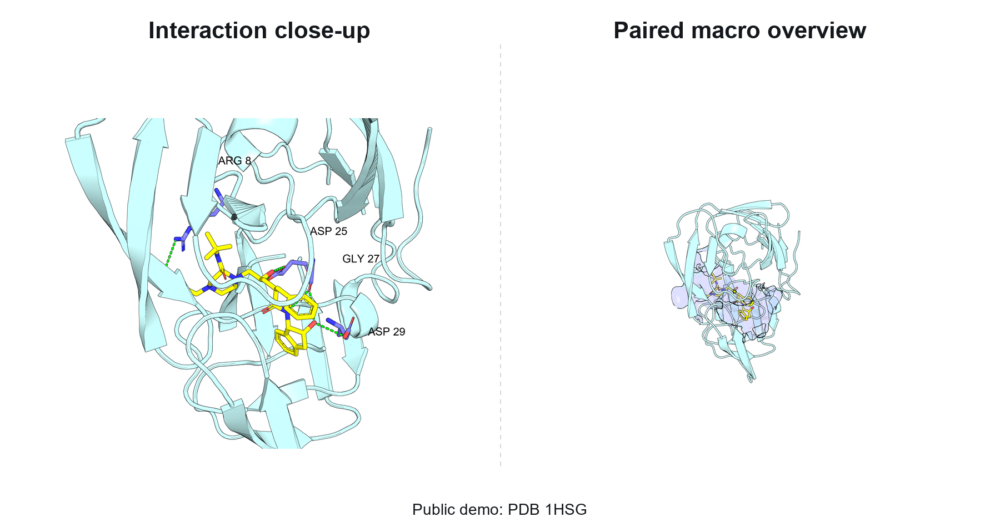

# PyMOL Figure Skill

Turn protein-ligand structures into publication-style PyMOL figures with one
Codex skill.

`pymol-figure` is designed for researchers who repeatedly need clean molecular
graphics but do not want to rewrite PyMOL scripts for every complex. It can
auto-detect protein-ligand interactions from PDB files with RDKit, render
close-up interaction panels, generate paired full-protein overview panels, and
optionally match the visual style of a reference figure supplied by the user.

<a href="docs/images/1hsg-demo.png">
  
</a>

Click the image to open the full-resolution demo.

Public demo: PDB `1HSG`. Left: interaction close-up with residue labels and
dashed contacts. Right: the paired macro overview from the same camera direction,
zoomed out to show the binding site in the full protein context.

## Why This Skill

- Produces both interaction close-ups and macro overview figures in one run.
- Uses consistent visual rules for colors, lighting, dashed contacts, labels,
  transparent backgrounds, and binding-pocket surfaces.
- Requires RDKit for higher-fidelity PDB interaction auto-detection, including
  strengthened ligand auto-selection, heavy-atom hydrogen-bond candidates for
  PDB files without hydrogens, salt bridges, pi interactions, and hydrophobic or
  close-contact pocket residues. Close contacts are reported for context but
  are not drawn by default unless `--include-close-contacts` is used.
- Supports reference-style rendering when the user provides an example PyMOL
  figure to imitate.
- Keeps the rendering engine in bundled scripts, so users do not have to build a
  custom PyMOL workflow from scratch.

## Output Modes

This skill has two main rendering modes:

1. **Default mode**: standardized publication-style PyMOL figures. The skill
   uses its built-in visual rules for colors, labels, lighting, interaction
   dashes, close-up views, and macro overview views. This is the best mode when
   the user only provides a structure file and, optionally, an interaction list.

2. **Reference-style mode**: user-guided visual matching. The user can provide
   an example PyMOL figure, and the skill will create a style profile that tries
   to match that image as closely as possible, including background,
   transparency, cartoon/surface visibility, label style, ray settings, colors,
   zoom/crop, and camera angle preferences.

Macro overview views are paired to the matching interaction close-up by default:
`macro_1` uses the same camera direction as `interaction_1`, zoomed out to the
full protein. Interaction views default to a tighter `interaction_zoom_buffer`
of 1.6 A, while paired macro views default to `macro.paired_zoom_buffer` of
10.0 A so the two figure types remain visually distinct.

## Pocket-Aware View Selection

The rendered angles are not random screenshots. The default workflow is designed
to show the binding pocket clearly while still giving enough camera diversity for
figure selection:

- Interaction close-ups are generated from six reproducible pocket-centered
  views. The camera rotates around the ligand and interacting residues at
  roughly 60-degree azimuth intervals, with a top/down view included for pocket
  geometry that is easier to read from above.
- Each macro overview is paired to the corresponding close-up. For example,
  `macro_1` keeps the camera direction from `interaction_1` but zooms out to the
  full protein, so the reader can connect the local contacts to the global
  protein context.
- If paired macro views are disabled, the renderer can choose macro angles from
  a candidate set. It renders low-resolution previews, scores them, and prefers
  views with fewer dark/shadowed regions and better ligand visibility.
- Users can override both close-up and macro view lists in a style profile when
  a manuscript, journal style, or reference image requires specific camera
  angles.

## What Users Need

Required:

- PyMOL with its Python executable available.
- A structural file (`.pdb`, `.maegz`, `.mol2`, or `.cif`).
- RDKit for automatic interaction detection.

Recommended:

- Pillow, for high-quality Arial label compositing.

RDKit is mandatory for automatic interaction detection from PDB files. On Windows,
use a real python.org Python 3.12 when possible instead of the WindowsApps Store
launcher. Set `PYMOL_FIGURE_RDKIT_PYTHON` to that interpreter, for example:

```powershell
[Environment]::SetEnvironmentVariable(
  "PYMOL_FIGURE_RDKIT_PYTHON",
  "C:\Users\you\AppData\Local\Programs\Python\Python312\python.exe",
  "User"
)
```

The detector reads both the current process environment and the Windows user
environment, then tries `py -3.12` as a fallback. If RDKit cannot be found,
auto-detection stops instead of using approximate fallback rules.

## Install As A Codex Skill

Copy the `pymol-figure/` folder into your Codex skills directory:

```powershell
Copy-Item -Recurse .\pymol-figure "$env:USERPROFILE\.codex\skills\pymol-figure"
```

Restart Codex so the skill can be discovered.

## First-Run Deployment Check

Before rendering anything, every user should verify PyMOL and RDKit:

```powershell
python .\pymol-figure\scripts\check_environment.py
```

The deployment is ready only when the check reports:

```text
[OK] PyMOL found
[OK] RDKit available
```

If PyMOL is installed in a custom location:

```powershell
python .\pymol-figure\scripts\check_environment.py --pymol "D:\PyMOL\python.exe"
```

If RDKit is installed in a separate Python, set:

```powershell
[Environment]::SetEnvironmentVariable(
  "PYMOL_FIGURE_RDKIT_PYTHON",
  "C:\Path\To\Python312\python.exe",
  "User"
)
```

Then restart Codex or the terminal and run the environment check again.

## Optional Environment Tips

If PyMOL's own Python does not have Pillow, install Pillow into another Python and
point the skill to it:

```powershell
$env:PYMOL_FIGURE_PYTHON = "C:\Path\To\python.exe"
```

## Default Mode Usage

Render with a manual interaction list:

```powershell
D:\PyMOL\python.exe .\pymol-figure\scripts\pymol_render.py `
  --input "complex.pdb" `
  --interactions "A/ASP/693 hbond, A/VAL/826 hbond, A/MN/4003 metal" `
  --output ".\outputs\complex_figures"
```

Auto-detect interactions from a PDB:

```powershell
py -3.12 .\pymol-figure\scripts\auto_detect_interactions.py complex.pdb --ligand MGP
```

If `--ligand` is omitted, the detector scores non-water, non-ion HETATM
residues and selects the most ligand-like organic residue. Then pass the printed
interaction spec into `pymol_render.py`. Use `--max-residues 6` or
`--max-residues 6` or `--max-residues 8` when a crowded pocket needs fewer
labels. Add `--include-close-contacts` only when you intentionally want gray
close-contact dashes for hydrophobic pocket context.

## Reference-Style Mode Usage

Create a JSON profile based on:

```text
pymol-figure/references/style-profile-template.json
```

Then render with:

```powershell
D:\PyMOL\python.exe .\pymol-figure\scripts\pymol_render.py `
  --input "complex.pdb" `
  --interactions "A/ASP/693 hbond, A/MN/4003 metal" `
  --style-profile ".\my-style.json" `
  --output ".\outputs\reference_style"
```

To let macro views choose independent overview angles instead of matching the
close-ups, set this in the style profile:

```json
{
  "macro": {
    "paired_to_interaction": false
  }
}
```

With `paired_to_interaction` disabled, the renderer uses preview-scored
auto-angles by default; set `"auto_angles": false` to force legacy fixed angles.

To tune the close-up versus overview scale, adjust:

```json
{
  "interaction_zoom_buffer": 1.6,
  "macro": {
    "paired_zoom_buffer": 10.0
  }
}
```

## Dependency Files

- `requirements.txt`: Python packages needed for labels and RDKit auto-detection.
- `requirements-rdkit.txt`: compatibility file listing the RDKit requirement.
- `environment.yml`: optional conda-style environment.
